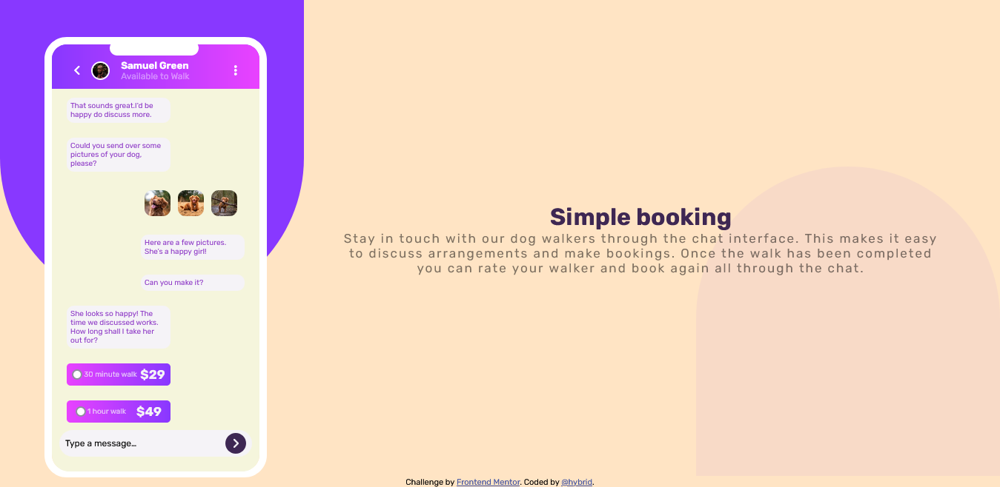

# Frontend Mentor - Chat app CSS illustration solution

This is a solution to the [Chat app CSS illustration challenge on Frontend Mentor](https://www.frontendmentor.io/challenges/chat-app-css-illustration-O5auMkFqY). Frontend Mentor challenges help you improve your coding skills by building realistic projects. 

## Table of contents

- [Overview](#overview)
  - [Screenshot](#screenshot)
  - [Links](#links)
  - [Built with](#built-with)
  - [What I learned](#what-i-learned)
  - [Continued development](#continued-development)
- [Author](#author)

## Overview
  
### Screenshot

### Links

- Solution URL: [solution URL](https://www.frontendmentor.io/challenges/chat-app-css-illustration-O5auMkFqY/hub/chatappcssillustrationmaster-BJHYb8w75)
- Live Site URL: [live site URL](https://delightful-figolla-9de3c6.netlify.app/)

### Built with

- Semantic HTML5 markup
- CSS custom properties
- Flexbox
- CSS Grid
- Mobile-first workflow

### What I learned

I learnt more about css animations as i used it to create loading interface for the app.I also got more experience concerning css positions.

### Continued development

I hope to develop more on css animations,I had some problems with the background which i hope to work on. 
 
## Author

- Frontend Mentor - [@Michaelhybrid](https://www.frontendmentor.io/profile/Michaelhybrid)
- Twitter - [@micheal_olu99](https://twitter.com/micheal_olu99)
